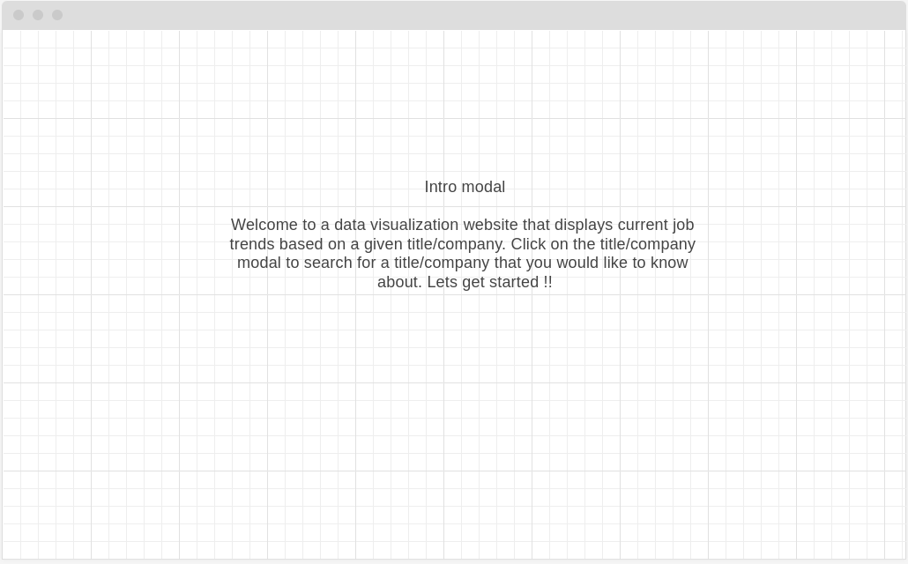
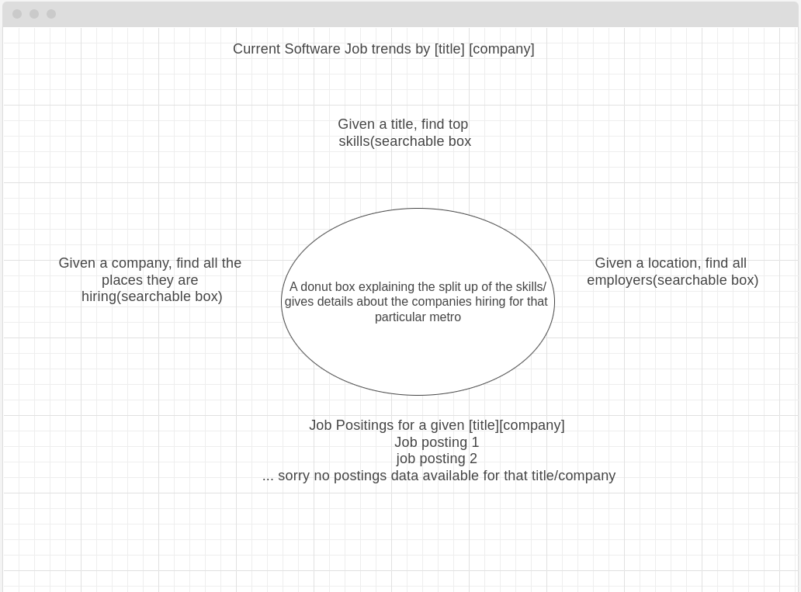

# JobTrends

## Background 
JobTrends is a data visualization website that displays current job trends based on a given title or a location. Users can enter title / location/ company in a searchable input box, upon which the website suggests top most skills listed for a given title or gives the top most employers for the given location or suggests companies hiring at a given location. The users will also be able to see any job postings that are listed for a given title/location/company.

## Technologies Used
* Javascript
* HTML5
* CSS

## Main WireFrame

## Functionality
* Introduction Modal to describe the website to users
* On clicking "lets get started, users will be taken to a page where a default title will be selected and skills will be displayed for that title.
* Users can hover over the graph to get the exact percentage data values
* Users can choose to enter title/location/company on which the page is re-rendered, with the donut having the new data.

## Implementation Timeline
* Friday Afternoon & Weekend - 
    * Cleanup data and have all data ready to be queried on. 
    * Have a basic page that renders the intro and take user to the next page ready.
* Monday
    * finish up the functionality.
    * handle every user input.
* Tuesday
    * finish up stylying the website.
* Wednesday
    * finish up stylying the website.
* Thursday Morning
    * buffer for any un-forseen issues.

## Data Links 
    * https://www.peopledatalabs.com/top-employers-dataset
    * https://www.peopledatalabs.com/top-skills-us-engineers-dataset
    * https://www.kaggle.com/datasets/arshkon/linkedin-job-postings?resource=download