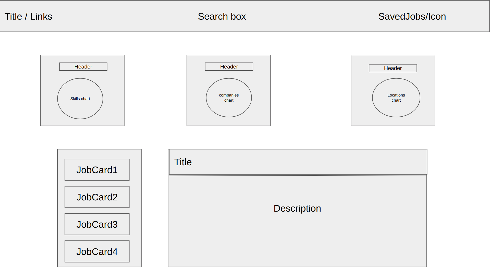
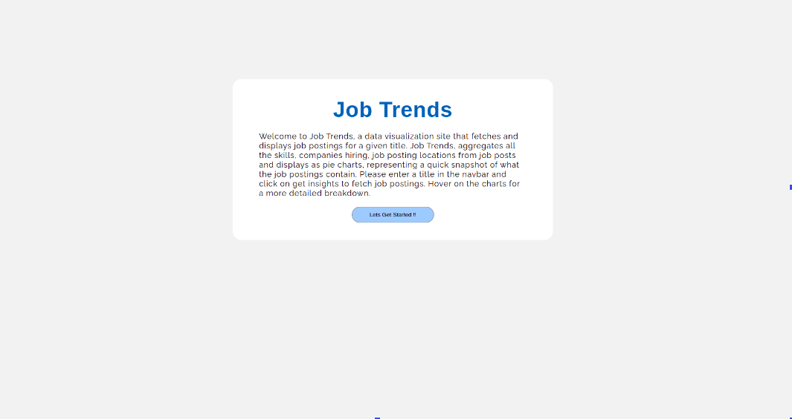
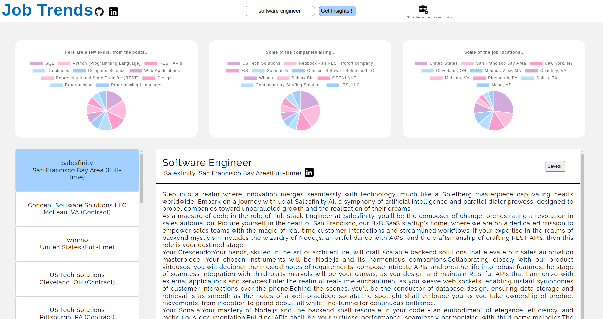

# JobTrends

## Background 
Job Trends is a data visualization site that fetches and displays job postings for a given title. Job Trends, aggregates all the skills, companies hiring, job posting locations from job posts and displays as pie charts, representing a quick snapshot of what the job postings contain.

## Technologies Used
* Javascript
* HTML5
* CSS
* Chart.js

## Main WireFrame

## Functionality
* Introduction modal/text to describe the website to users
* On providing title, job posts will be pulled and an aggregate of skills, companies, location will be displayed as pie charts..
* Users can hover over the graph to get the exact data values.
* Users can choose to enter a different title on which the page is re-rendered, with the chart having the new data.
* Users will be able to save a job post by clicking on the save btn.
* Users can remove a saved job by clicking on saved!! btn.
* Users can take a look at their saved jobs by clicking at the "Saved jobs" icon on the top right.

## Implementation Timeline
* Friday Afternoon & Weekend - 
    * Cleanup data and have all data ready to be queried on. 
    * Have a basic page that renders the intro and take user to the next page ready.
* Monday
    * finish up the functionality.
    * handle every user input.
* Tuesday
    * finish up stylying the website.
* Wednesday
    * finish up stylying the website.
* Thursday Morning
    * buffer for any un-forseen issues.

## Data Links
    https://www.kaggle.com/datasets/arshkon/linkedin-job-postings?resource=download

## Intro Modal

## Main Page

